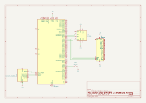

## Weather Sensor

Source code to accompany the [weather sensor article](https://tmpfs.org/posts/weather-sensor/).

Demonstrates connecting the [BME280][] sensor with a [MAX7219][] 7-segment LED display controlled by a [Nordic nRF52840][].

## License

MIT or Apache-2.0

[Nordic nRF52840]: https://www.nordicsemi.com/Products/nRF52840
[BME280]: https://www.bosch-sensortec.com/media/boschsensortec/downloads/datasheets/bst-bme280-ds002.pdf
[MAX7219]: https://www.analog.com/media/en/technical-documentation/data-sheets/MAX7219-MAX7221.pdf
